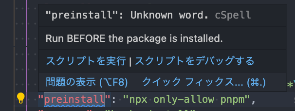
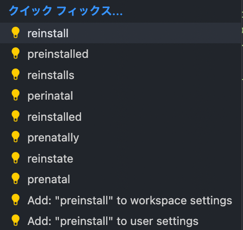

# How to Use with VS Code Extension

## English

This section describes how to use Code Spell Checker, an extension of CSpell for VS code.

(Taken from Code Spell Checker Marketplace)

If there is a word in the open file that is not listed in the dictionary, it will be underlined.
If it is a typo, a quick fix will be suggested.
To display a list of suggestions, hover the cursor over a word and then use one of the following methods:

- Click on the 💡 (light bulb) in the left margin.
- Action commands in the Quick Fix Editor
  - Mac: `⌘+.` or `Cmd+.`.
  - PC: `Ctrl+.`

In the candidate list

- Add: "{word}" to workspace settings: registered in cspell.json and available per repository.
- Add: "{word}" to user settings: registered in VS Code's settings.json and shared on an individual github account.

Translated with www.DeepL.com/Translator (free version)

## Japanese

CSpellのVS code用拡張機能であるCode Spell Checkerの使い方について説明します。

（Code Spell Checker Marketplaceより引用）

開いているファイルの中で辞書に記載されていない単語があると下線が引かれます。
typoの場合はクイックフィックスより修正が提案されます。
候補のリストを表示するには単語内にカーソルを置いた後、以下のいずれかの方法で候補リストを表示させることができます：

- 左側の余白にある💡（電球）をクリックします。
- Quick Fix Editorのアクションコマンド
  - Mac: `⌘+.` または `Cmd+.`
  - PC: `Ctrl+.`

候補リストの中には

- Add: "{word}" to workspace settings: cspell.jsonに登録され、リポジトリ単位で利用できる。
- Add: "{word}" to user settings: VS Codeのsetting.jsonに登録され、個人のgithubアカウントで共有される。
